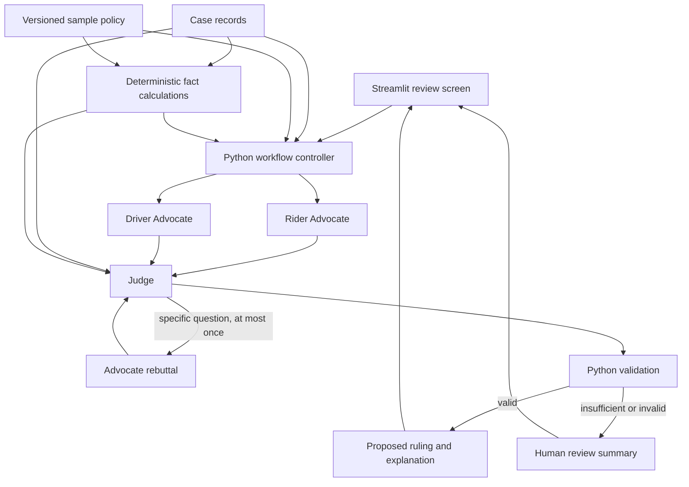

# FairRide Project Guide

FairRide is a proposed evidence-based dispute reviewer for the Ryde Digital Native track of the Tencent Cloud AI Agent Hackathon Singapore 2026. It aims to resolve standard ride disputes quickly while showing riders, drivers, and reviewers why a decision was made. This guide is the shared design and work agreement for a two-person team. Sections marked **planned** describe work that is not yet implemented.

The organizer's brief calls for a Rider Advocate, a Driver Advocate, and an impartial Judge; text and structured evidence; visible agent communication; an end-to-end demonstration for at least two dispute categories; an architecture diagram; and source code. The first two categories selected here are **no-show charges** and **route deviations**. These category choices and the implementation details below are team proposals, not organizer-mandated designs.

## Current project state

As of 5 October 2026, the repository contains one no-show case (`DISP-002`), a labelled sample no-show policy, a read-only Streamlit screen, and a policy-configured wait-time calculation, shared Pydantic contracts, evidence IDs and lookups, citation checks, hand-written output examples, and nine passing unit tests. The three functions in `agents.py` and the function in `workflow.py` deliberately raise `NotImplementedError`. There are no model calls, rebuttals, rulings, route-deviation cases, or submitted refunds yet. `requirements.txt` contains Streamlit and Pydantic v2. See `docs/PERSON_B_HANDOFF.md` for the implemented interfaces and the remaining work.

The original sample document remains in `data/`. The JSON in `cases/DISP-002.json` excludes the expected ruling. Keep expected answers in tests or evaluation files, never in material sent to a model.

## Users and decisions

The immediate user is a dispute reviewer or demo judge selecting a case and inspecting its resolution. Riders and drivers are recipients of the final explanation. The MVP recommends actions; it does not connect to a real payment or refund API.

For each case, the system must answer: What happened according to the records? Which policy applies? What evidence supports each side? What action follows? What remains uncertain? The result is either a proposed ruling and action, or a case summary for human review.

## MVP scope and completion criteria

| Area | MVP behavior | How to verify |
|---|---|---|
| No-show charge | Assess pickup position, arrival and cancellation times, contact attempts, fee, and sample policy. | A rider-favorable, driver-favorable, and ambiguous case produce appropriate outcomes. |
| Route deviation | Compare supplied planned and actual route records, trip duration, fare items, messages, and sample policy. | A justified route, unjustified route, and ambiguous case produce appropriate outcomes. |
| Three agents | Two advocates present separate cited cases; the Judge addresses both and makes a provisional or final assessment. | The activity log shows distinct calls, arguments, and Judge response. |
| Rebuttal | The Judge may ask one specific question; relevant advocates respond once using available records. | A case with conflicting arguments completes within one rebuttal round. |
| Evidence | Claims cite stable IDs pointing to source records or explicit policy clauses. | Unknown IDs are rejected; each displayed citation opens its source. |
| Decision check | Python verifies required inputs, citations, policy conditions, and money calculations. | Missing or contradictory material facts cause human review, not an unsupported ruling. |
| Demo | Reviewer can select cases and see evidence, activity, result, and rationale. | Both categories run end to end in a live walkthrough. |

Photograph analysis, fraud detection, automated payment execution, external ride APIs, and learning from historical rulings are outside the first build. The brief treats advanced agents and image analysis as stretch goals. A human-review path is proposed here as a safeguard for uncertain cases.

## System architecture



Streamlit presents information. Plain Python controls the agent sequence. A model API supplies language interpretation and argument generation. JSON files supply the initial case and policy records. The model has read-only access to evidence and no ability to issue refunds. The same model connection can serve all three roles with different instructions; using a stronger Judge model is an evaluation decision, not an architectural requirement.

## Case review pipeline

1. **Load:** Select a case and the policy version assigned to its dispute type. Preserve the raw records and their source IDs.
2. **Calculate:** Derive times, distances, fare differences, and policy thresholds in Python. Keep the source IDs and formula for each derived fact.
3. **Advocate:** Call Rider Advocate and Driver Advocate separately. Both see the same relevant records and policy. Each returns supported claims, counterpoints, and unanswered questions from its assigned perspective.
4. **Provisional review:** The Judge receives both arguments, the original evidence, and the calculated facts. It may request a specific missing piece of evidence, make a final ruling, or refer the case to a human.
5. **Rebuttal, if requested:** The workflow passes the Judge's precise question to the relevant advocate or advocates. They may cite existing or newly retrieved case records; they may not invent new records. The Judge reviews the responses once.
6. **Validate:** Python checks output shape, source IDs, policy IDs, policy conditions, proposed amount, and the one-round limit. A model-generated confidence score is displayed as context but cannot override these checks.
7. **Present:** Show the arguments, question and responses if any, decisive evidence, policy, proposed action, and explanation to both parties. If checks fail or facts remain material and unresolved, show a human-review summary instead.

The UI activity log should show actions and cited outputs, not hidden model reasoning. For the current sample, a fair claim is “GPS records place the driver at the recorded pickup coordinates at 08:43”; that alone does not prove where the rider stood or that the designated physical entrance was unambiguous.

## Evidence references and derived facts

**Implemented convention:** Assign an explicit, stable `id` to each source record when preparing a case. Examples: `GPS-005`, `CHAT-003`, `EVENT-004`, `FARE-001`, and `POLICY-002`. Keep IDs stable when editing a case; do not rely on an array index at runtime. A policy ID must point to one specific rule or clause. The current fixture includes explicit IDs on its ticket, trip, GPS, chat, and event records; its sample policy has six clause IDs. `evidence.py` resolves these IDs and rejects missing, duplicate, or unknown references.

An advocate claim can have this shape:

```json
{
  "statement": "The driver was at the recorded pickup coordinates at 08:43.",
  "evidence_ids": ["GPS-005", "EVENT-004"],
  "policy_ids": []
}
```

Build a case-local lookup from IDs to original records. After each model call, reject references absent from that lookup. An ID's existence confirms traceability, not that the cited record actually supports the statement; the Judge and the final validation still need to check the relationship. For a derived fact such as “eight minutes elapsed,” store its source record IDs, formula, and computed value. The source records remain the primary evidence.

For fee eligibility, use trip and policy facts. Historical dispute counts, ratings, and fraud flags may appear in the sample but must not by themselves decide whether this particular charge was valid. Avoid turning those profiles into a credibility score for the MVP.

## Agent handoff contract

**Implemented shared contract v1.0.** `contracts.py` validates agent input and output with Pydantic v2. Use `docs/PERSON_B_HANDOFF.md` and `examples/agent_outputs.json` for exact fields, interfaces, and examples. Model calls remain unimplemented.

| Output | Required fields | Meaning |
|---|---|---|
| Advocate result | `role`, `claims`, `counterpoints`, `unanswered_questions` | Each claim or counterpoint has `statement`, `evidence_ids`, and `policy_ids`. Both advocates use the same structure. |
| Judge result | `action`, `question`, `rebuttal_roles`, `ruling`, `proposed_action`, `explanation`, `evidence_ids`, `policy_ids`, `confidence` | `action` is `request_rebuttal`, `final_ruling`, or `human_review`. Fields unrelated to the chosen action may be empty. |
| Workflow result | `case_id`, `status`, `activity_log`, `judge_result`, `validation_issues` | The UI renders this result; it does not infer a ruling from raw model text. |

The ruling vocabulary is `uphold_charge`, `reverse_charge`, `partial_refund`, and `no_action`. Human review is an action/status rather than a ruling. `proposed_action.amount_cents` is the refund to the rider, in integer SGD cents. The proposed refund or compensation amount must use Python's `Decimal` or integer cents. Only the application calculates the amount; the Judge explains why that amount applies.

## Current sample policy and open decisions

`policies/sample_no_show.json` specifies a five-minute free wait, an eight-minute no-show threshold, and a S$5 charge. It also sets `wait_start_event` to driver arrival. In `DISP-002`, arrival is 08:43, scheduled pickup is 08:45, and cancellation is 08:51. The current calculator therefore records eight minutes of driver wait. This is a **synthetic policy interpretation**, not a verified Ryde rule.

Before treating a no-show outcome as policy compliant, confirm whether the wait clock begins at arrival or scheduled pickup, how the designated pickup point is defined, whether attempted contact is mandatory, and how the charge is paid or reversed. Until official policy is available, use explicit sample rules and say so in the demo.

For route deviation, the team must agree on a sample policy and supply planned route, actual route, route exceptions, fare components, and any rider instructions. Do not label a route unfair solely because its distance exceeds a straight-line map distance; use a supplied planned road route or an appropriate route service.

## Model connection and code map

The initial Python scaffold uses `agents.py`. After confirming the handoff contract, split it if both people need independent file ownership:

| File | Responsibility | State |
|---|---|---|
| `app.py` | Case selection, evidence and agent activity, final result | Read-only case view exists; review UI planned |
| `case_data.py` | Load case and policy JSON | Implemented |
| `checks.py` | Calculate facts; later validate citations, amounts, and rulings | No-show facts implemented; final checks planned |
| `agents/client.py` | One model API connection, key handling, model selection | Planned |
| `agents/advocates.py` | Rider and Driver Advocate prompts and calls | Planned; placeholders currently in `agents.py` |
| `agents/judge.py` | Provisional and final Judge prompts and calls | Planned; placeholder currently in `agents.py` |
| `contracts.py` | Shared input/result schemas and valid actions | Implemented |
| `evidence.py` | Evidence lookup, normalized input, citation checks | Implemented |
| `workflow.py` | Call order, rebuttal limit, activity log, final validation | Placeholder |
| `cases/`, `policies/` | Case and sample policy fixtures | One no-show case and policy exist |
| `tests/` | Calculations, contracts, citations, and later workflow evaluation | Nine fact and shared-interface tests exist |

The model provider is a configuration choice. Tencent TokenHub is a candidate because it offers models through an OpenAI-compatible API; any permitted accessible model can be tested. Do not assume CodeBuddy or WorkBuddy development credits include runtime model API usage. Store API keys in environment variables or deployment secrets, never in the repository. Add model dependencies to `requirements.txt` only when the corresponding code is implemented.

## Two-person work split

Both people should work directly with AI. Agree on the example input, evidence IDs, `contracts.py`, and model connection first. Then use primary ownership to limit merge conflicts:

| Person A | Person B |
|---|---|
| Implement and evaluate both advocates in `agents/advocates.py`. | Implement and evaluate the Judge in `agents/judge.py`. |
| Prepare no-show variants and advocate evidence checks. | Implement the one-round controller in `workflow.py` and prepare route-deviation variants. |
| Build the evidence section of `app.py`. | Build the decision and activity-log section of `app.py`. |
| Review a difficult Judge case and improve its prompt with Person B. | Review a difficult advocate case and improve its prompt with Person A. |

Both people own the final integrated tests and live demo. Because this repo has no initial commit yet, establish the shared scaffold and contract in a first commit before separate branches. Keep work in separate files where possible; integrate a working case daily rather than waiting for both sides to be “finished.”

## Evaluation and tests

Start with at least six hand-labelled cases: rider-favorable, driver-favorable, and ambiguous for each of the two dispute categories. Keep labels outside agent inputs. For each run, record the model, prompt version, case ID, answer, cited IDs, validation failures, latency, and approximate cost. Do not describe these six cases as proof of production accuracy; they are a development set.

Track these checks separately:

- **Ruling agreement:** Does the proposed decision match the team's policy-based expected outcome?
- **Evidence integrity:** Are all IDs real, and do decisive claims follow from the cited records?
- **Arithmetic:** Are time, distance, and refund calculations reproducible in Python?
- **Abstention:** Do missing or contradictory facts lead to human review?
- **Explanation quality:** Can a rider, driver, and reviewer understand the same outcome?
- **Performance:** How long and how much does one complete case, including rebuttal if needed, take?

Existing checks run with `python3 -m unittest discover -s tests -v`. Add focused tests as each behavior is implemented, then run the whole suite. Rehearse the live demo with both categories and one ambiguous case. Capture visible inter-agent communication without exposing raw credentials or hidden model reasoning.

## Build order and submission

1. Use the implemented evidence IDs, sample policy clauses, shared contracts, and Person B handoff; review assumptions before extending them.
2. Make the no-show case work end to end with the two advocates, Judge, one optional rebuttal, validation, and a visible result.
3. Add a contrasting no-show case, then route-deviation cases and their deterministic checks.
4. Evaluate the labelled cases, fix unsupported claims, and rehearse the UI and explanation.
5. Prepare the architecture diagram, live walkthrough, GitHub source, cover image, and submission text.

The supplied brief lists **16 October 2026** for project submission, **23 October** for finalist announcements, and **3 November** as a tentative Demo Day. It requires a project title, a blurb under ten words, a project description covering users, scenarios, design, and value, and a 16:9 cover image. It also requires that the project be built with at least one of CodeBuddy or WorkBuddy and include **at least three screenshots or a screen recording of development conversations** as proof of usage. A demo video and live project URL are optional; the brief says a project link can earn bonus points. Check the organizer's handbook for any later or track-specific changes.

## Source notes

The challenge and submission requirements above come from the organizer's locally supplied Tencent Cloud Hackathon 2026 brief, especially pages 21–26 and 37–40. `data/RydeResolve Sample Dataset — DISP-002 No-Show Charge Dispute (SG).md` is the original sample used for the first case. Architecture, contracts, team split, sample policy interpretation, and evaluation approach are proposed project decisions documented here for team review.
